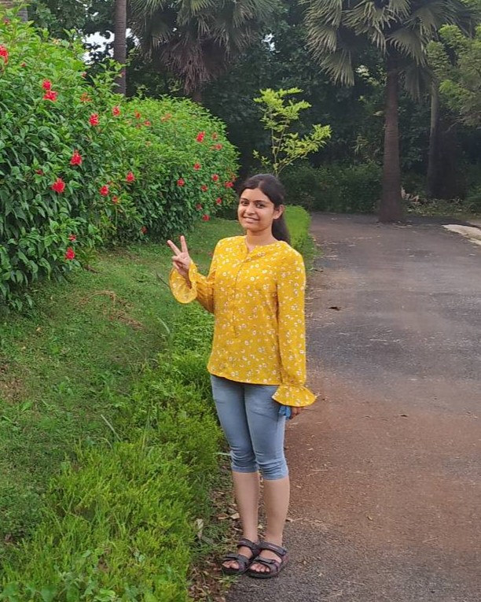

# About Me

Hi, this is **Shikha Mallick**.

I am a Ph.D. student in the Department of **Computer Science** at University of Victoria, BC, Canada. Here is <a href="file/Shikha_Mallick_Resume.pdf" target="_blank" rel="noopener"
   aria-label="[my CV] (opens in a new tab)">
  [my CV] ↗
</a>.

 

## Academic Background

**[Highlight] I am looking for internships to start in 2026 Fall. Contact me if you have any leads!**

- **Jul 2019 - Jul 2022:** Indian Institute of Technology Palakkad (Master of Science (MS) by Research)
- **Aug 2013 - June 2017:** Dr. A.P.J. Abdul Kalam Technical University (Bachelor of Technology)

 

---

## Research Interests

- Bias in Social Networks
- Generative AI
- AI in Drug Discovery

My current work focuses on mitigating bias in social networks. I also have experience in practical problems that artificial intelligence faces in real world applications like healthcare, autonomous driving, among others. I wish to devote my talent to creating significant contributions in the field of AI.

 

---

## News and Updates

- **Mar 2024：**My first paper [CDGCN: Conditional de novo Drug Generative Model Using Graph Convolution Networks](https://link.springer.com/chapter/10.1007/978-3-031-29119-7_7) has received its first citation! h-index 1.
- **Apr 2023：**Our work, [Physics and Data-Informed Formulation Design and Development for Chemical Processes](https://aiche.confex.com/aiche/2023/meetingapp.cgi/Paper/662550), has been accepted in AIChe Spring Meet 2023.
- **Apr 2023：**My first paper, [CDGCN: Conditional de novo Drug Generative Model Using Graph Convolution Networks](https://link.springer.com/chapter/10.1007/978-3-031-29119-7_7) is published in RECOMB 2023, see you in Istanbul!
- **Aug 2021：**We won first prize for our work, [XGB-EVM](https://github.com/mshik/XGB-EVM), in the AI for Healthcare hackathon sponsored by SINE IITB and Derbi Foundation.
- **Jun 2022：**Successfully defended my MS thesis!
- If you are interested in my work, please feel free to chat/mail on [[my gmail](mallickshikha@gmail.com)].
